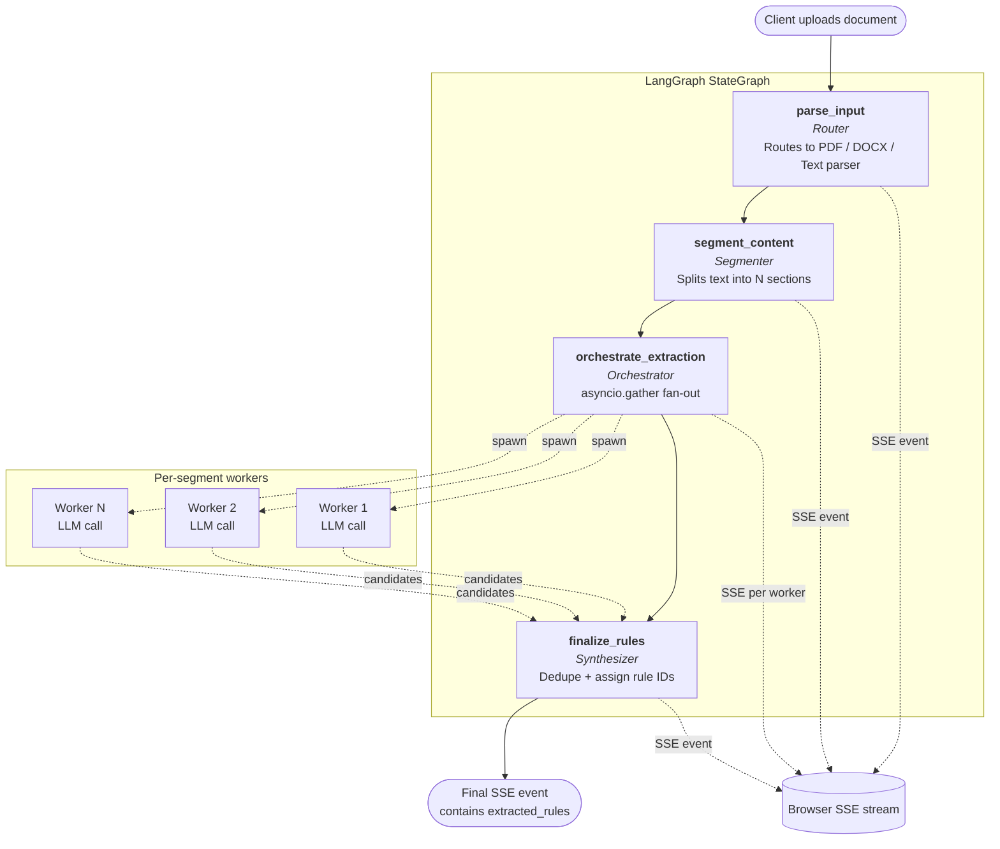

# Document Validator

A document compliance verification system. Upload a rules document, extract structured compliance rules using an LLM, review and edit them, then audit any user document against those rules.

## How It Works

**Phase 1 — Rules Extraction**
Upload a rules document (PDF, DOCX, or plain text). The backend segments it, sends each section to an LLM in parallel, and streams real-time progress back to the UI via Server-Sent Events. The final event delivers the full extracted rules list.

**Phase 2 — Audit** *(coming soon)*
Upload a user document and run it against the confirmed rules. Each rule is evaluated using RAG (retrieval-augmented generation) — evidence passages are retrieved from a vector DB and passed to the LLM for a pass/fail decision.

## Phase 1 Pipeline Architecture

The Phase 1 extraction pipeline is built on **LangGraph** as four sequential nodes — `parse_input`, `segment_content`, `orchestrate_extraction`, `finalize_rules` — and uses an **orchestrator-worker** pattern: `orchestrate_extraction` fans out per-segment LLM calls in parallel via `asyncio.gather`, then `finalize_rules` aggregates the candidates. Every node also emits **Server-Sent Events** to the client in real-time, so the UI sees progress as it happens.



Each node's role:

| Node | Pattern | Responsibility |
|------|---------|----------------|
| `parse_input` | Router | Dispatches the input to the correct parser based on file type, normalizes everything to plain text |
| `segment_content` | Segmenter | Splits the text into logical sections (numbered headings, ALL-CAPS, Markdown, Article/Section/Chapter patterns); falls back to paragraph-boundary chunking when sections exceed `max_chars` |
| `orchestrate_extraction` | Orchestrator | Fans out one async LLM worker per segment via `asyncio.gather`; emits a progress event each time a worker completes; counts and reports failed workers in the `extraction_complete` event |
| `finalize_rules` | Synthesizer | Deduplicates candidates by normalized title, assigns sequential `rule_NNN` IDs, and packages the final list into the `finalization_complete` SSE event |

> The diagram above is a conceptual view. The auto-generated LangGraph diagram (via `pipeline._graph.get_graph().draw_mermaid()`) shows the four nodes only — the per-segment workers exist *inside* `orchestrate_extraction` as `asyncio` tasks rather than as separate graph nodes.

## Prerequisites

- **Node.js** 18+ and npm
- **Python** 3.11+
- One of the following LLM setups:
  - [Ollama](https://ollama.com) running locally (default) — `ollama pull llama2` or `ollama pull mistral`
  - Anthropic API key
  - Grok (xAI) API key

## Setup & Run

### Backend

```bash
cd backend
pip install -r requirements.txt
cp .env.example .env        # then edit .env with your provider choice
python main.py              # starts on http://localhost:8000
```

API docs available at `http://localhost:8000/docs`

### Frontend

```bash
cd frontend
npm install
cp .env.example .env        # edit VITE_API_BASE_URL if backend is not on port 8000
npm run dev                 # starts on http://localhost:3000
```

## LLM Provider Configuration

Set these in `backend/.env`:

```env
# Ollama (local, no API key required)
LLM_PROVIDER=ollama
LLM_MODEL=llama2            # or mistral, or any model you have pulled
OLLAMA_HOST=http://localhost:11434

# Anthropic (Claude)
LLM_PROVIDER=anthropic
LLM_API_KEY=sk-ant-...
LLM_MODEL=claude-haiku-4-5-20251001

# Grok (xAI)
LLM_PROVIDER=grok
LLM_API_KEY=xai-...
LLM_MODEL=grok-3-mini
```

Restart the backend after changing the provider.

## Logging

The backend writes structured logs to both the terminal and a rotating log file.

**Default log file**: `backend/logs/app.log` (10 MB per file, 5 backups kept)

```bash
# Follow logs in real-time
tail -f backend/logs/app.log
```

**What gets logged**:
- Worker failures (LLM timeouts, JSON parse errors) with full tracebacks
- All SSE events in real-time (when `LOG_LEVEL=DEBUG`)
- Pipeline stage transitions and metrics (segments found, rules extracted, deduplication, etc.)

Configure in `backend/.env`:

```env
LOG_LEVEL=INFO              # DEBUG | INFO | WARNING | ERROR
LOG_FILE=logs/app.log       # relative to backend/; set empty to disable file logging
```

Enable `LOG_LEVEL=DEBUG` to see SSE events logged as they stream:
```
[SSE] parsing_complete | parsing | Document parsed: 12,450 characters
[SSE] segmentation_complete | segmentation | Found 5 logical sections
[SSE] extraction_progress | extraction | Processed "Section 1"
```

If extraction completes but some sections failed, a warning toast appears in the UI directing you to the log file for details.

## UI Flow

The frontend is a three-step flow inside a single card:

1. **Upload** — drag-and-drop or paste your rules document; click "Extract Rules"
2. **Live progress** — the card shows real-time extraction milestones as the pipeline runs; a warning toast appears if any sections fail
3. **Review & Confirm** — the card transitions to show a collapsed "Extraction Complete" summary (expand it for the full event log) above the extracted rules list; edit, delete, or add rules before confirming
4. **Ready for Audit** — confirmation screen (extraction progress hidden); Phase 2 audit coming soon

**Error handling**: If a network error or backend failure occurs during extraction, the progress bar clears and the page resets to step 1 with an inline error alert above the form and a snackbar notification.

## Supported Input Formats

| Format | Extension | Notes |
|--------|-----------|-------|
| PDF | `.pdf` | Text extracted page-by-page |
| Word | `.docx`, `.doc` | Paragraph text extracted |
| Plain text | `.txt` or paste | Used directly |

Max file size: 10 MB. Max pasted text: 50,000 characters.

## Tech Stack

| Layer | Technology |
|-------|-----------|
| Frontend | React 18, Vite, Material UI 5, React Router |
| Backend | Python, FastAPI, LangGraph |
| LLM | Ollama / Anthropic / Grok — config-driven |
| Streaming | Server-Sent Events (sse-starlette) |
| Vector DB | Phase 2 — TBD |

## Project Structure

```
document-validator/
├── frontend/     # React application
├── backend/      # FastAPI + LangGraph pipeline
│   └── logs/     # Runtime log files (app.log written here)
└── CLAUDE.md     # Full technical reference for contributors
```

See [CLAUDE.md](./CLAUDE.md) for the complete architecture reference, design decisions, and contribution guide.
